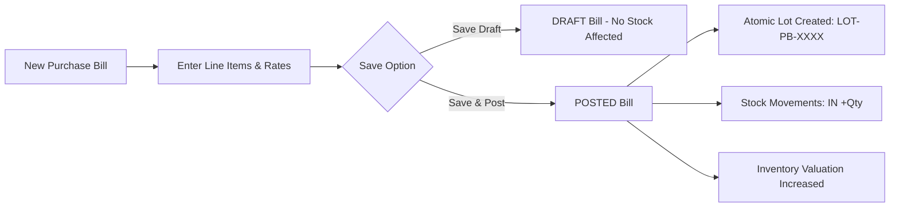
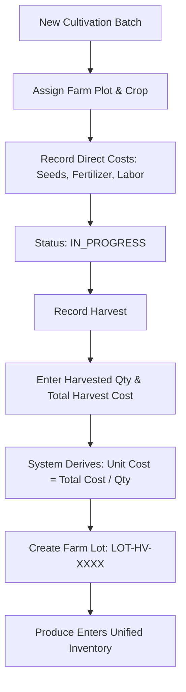
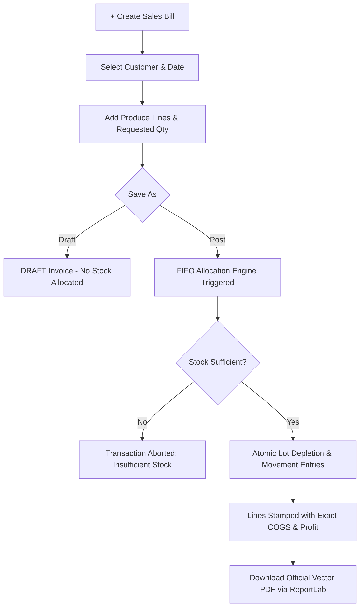

# 🌾 Farm Suit — Client & Operator User Manual
### Unified Farm Business Management Platform
**Version:** 1.0 (Production Release)  
**Author:** Farm Suit Engineering Team  
**Audience:** Farm Owners, Operations Managers, Procurement Staff, Agronomists, Sales & Billing Officers, and Accountants.

---

## 📑 Table of Contents

1. [Executive Overview](#1-executive-overview)
2. [System Architecture & Core Philosophy](#2-system-architecture--core-philosophy)
3. [Accessing the Application & User Interface](#3-accessing-the-application--user-interface)
4. [Master Data Management](#4-master-data-management)
   - 4.1 [Units of Measure (UOM)](#41-units-of-measure-uom)
   - 4.2 [Item Categories](#42-item-categories)
   - 4.3 [Items & Agricultural Products](#43-items--agricultural-products)
   - 4.4 [Vendors & Suppliers](#44-vendors--suppliers)
   - 4.5 [Customers & Wholesale Buyers](#45-customers--wholesale-buyers)
   - 4.6 [Farm Plots & Fields](#46-farm-plots--fields)
5. [Channel 1: Indirect Trading (Procurement)](#5-channel-1-indirect-trading-procurement)
   - 5.1 [Understanding Purchase Bills](#51-understanding-purchase-bills)
   - 5.2 [Creating & Posting a Purchase Bill](#52-creating--posting-a-purchase-bill)
   - 5.3 [Automated Lot Generation](#53-automated-lot-generation)
   - 5.4 [Purchase Reversals & Return Policy](#54-purchase-reversals--return-policy)
6. [Channel 2: Direct Farming (In-House Cultivation)](#6-channel-2-direct-farming-in-house-cultivation)
   - 6.1 [Cultivation Batches & Lifecycle](#61-cultivation-batches--lifecycle)
   - 6.2 [Setting Up a New Cultivation Batch](#62-setting-up-a-new-cultivation-batch)
   - 6.3 [Recording a Harvest & Unit Cost Derivation](#63-recording-a-harvest--unit-cost-derivation)
   - 6.4 [Farm Produced Lot Generation](#64-farm-produced-lot-generation)
7. [Unified Inventory Engine & FIFO Costing](#7-unified-inventory-engine--fifo-costing)
   - 7.1 [The Single Inventory Pool](#71-the-single-inventory-pool)
   - 7.2 [Stock Overview & Minimum Stock Alerts](#72-stock-overview--minimum-stock-alerts)
   - 7.3 [Inventory Lots Breakdown](#73-inventory-lots-breakdown)
   - 7.4 [Stock Movement Ledger (Auditability)](#74-stock-movement-ledger-auditability)
   - 7.5 [How FIFO Cost Allocation Works (Step-by-Step Example)](#75-how-fifo-cost-allocation-works-step-by-step-example)
8. [Sales, Invoicing & Vector PDF Generation](#8-sales-invoicing--vector-pdf-generation)
   - 8.1 [Creating a Sales Bill (Invoice)](#81-creating-a-sales-bill-invoice)
   - 8.2 [Draft vs. Posted Sales Bills](#82-draft-vs-posted-sales-bills)
   - 8.3 [Automatic Line-Level COGS & Profit Badges](#83-automatic-line-level-cogs--profit-badges)
   - 8.4 [Downloading Official ReportLab Vector PDFs](#84-downloading-official-reportlab-vector-pdfs)
   - 8.5 [Controlled Bill Reversals](#85-controlled-bill-reversals)
9. [Business Intelligence & Financial Reports](#9-business-intelligence--financial-reports)
   - 9.1 [Executive Dashboard & 7-Day Velocity](#91-executive-dashboard--7-day-velocity)
   - 9.2 [Derived Profit & Loss Report](#92-derived-profit--loss-report)
   - 9.3 [Sales Analysis Report](#93-sales-analysis-report)
   - 9.4 [Procurement Report](#94-procurement-report)
   - 9.5 [Inventory Valuation Report](#95-inventory-valuation-report)
10. [Audit Trail & Governance](#10-audit-trail--governance)
    - 10.1 [Immutable Append-Only Audit Log](#101-immutable-append-only-audit-log)
    - 10.2 [Quick Tooltip Inspections (🕒)](#102-quick-tooltip-inspections-)
    - 10.3 [Entity Change Timeline Drawer](#103-entity-change-timeline-drawer)
    - 10.4 [Global Audit Trail Exploration](#104-global-audit-trail-exploration)
11. [Daily Operational Checklist](#11-daily-operational-checklist)
12. [Troubleshooting & Frequently Asked Questions](#12-troubleshooting--frequently-asked-questions)
13. [Glossary of Terms](#13-glossary-of-terms)

---

# 1. Executive Overview

**Farm Suit** is an enterprise-grade agricultural enterprise resource planning (ERP) platform. It provides agricultural businesses with an integrated, single pane of glass to run both:

1. **Indirect Trading:** Purchasing agricultural commodities (e.g. Rice, Wheat, Pulses, Vegetables, Fertilizers) from external vendors/markets and reselling them.
2. **Direct Farming:** Cultivating crops on owned or leased land plots, recording cultivation expenses, harvesting produce, and selling farm yields.

### Key Differentiator: Unified Inventory & FIFO Costing
Traditional farm software separates traded goods from farmed produce, causing disjointed stock books and unreliable financial reports. Farm Suit unifies all produce into a **Single Inventory Pool (`InventoryLot`)**. Regardless of whether an apple came from an external vendor or from your North Orchard, it enters the same inventory tracking system. 

When a sale occurs, Farm Suit applies **Strict First-In, First-Out (FIFO)** costing. The oldest batch is consumed first, and its exact production or purchase cost is deducted. This delivers **100% accurate, line-level Gross Profit & Cost of Goods Sold (COGS)** without guesswork.

```
                    FARM SUIT PLATFORM
                            │
         ┌──────────────────┴──────────────────┐
         │                                     │
   INDIRECT TRADING                      DIRECT FARMING
  Vendor Purchases                       In-House Crops
  (PurchaseBill)                         (CultivationBatch)
         │                                     │
         └──────────────────┬──────────────────┘
                            ▼
                    UNIFIED INVENTORY
               Single Lot Engine (InventoryLot)
         (Source: PURCHASE vs. HARVEST, Exact Unit Cost)
                            │
                            ▼
                     SALES & BILLING
             Atomic FIFO Allocation Engine
       (Strict Non-Negative Stock, Exact Line COGS)
                            │
                            ▼
               FINANCIAL REPORTS & AUDIT
       (Derived Real-Time Profit, Server-Side Vector PDFs,
              Immutable Append-Only Audit Trail)
```

---

# 2. System Architecture & Core Philosophy

To guarantee accuracy and legal compliance, Farm Suit adheres to five foundational engineering principles:

1. **Authoritative Backend Computation:**
   - Web browsers display previews, but the backend server always performs the final, binding mathematical calculations for totals, taxes, discounts, stock availability, COGS, and profit.
2. **Atomic Financial Transactions:**
   - Multi-line purchase bills, harvests, and sales invoices are processed inside database transactions (`select_for_update()`). If any single lot lacks stock or a database error occurs, the entire transaction rolls back cleanly.
3. **Strict Non-Negative Stock Invariant:**
   - System stock is physically bounded by the database (`CHECK available_quantity >= 0`). Selling more produce than you physically possess is strictly prohibited.
4. **Dynamically Derived Profit (Zero Stale Tables):**
   - Farm Suit never stores static profit balances that can become desynchronized. All profitability figures are derived on the fly from posted sales lines and their underlying lot cost records.
5. **Legally Binding Server-Side Vector PDFs:**
   - Invoices and bills are rendered directly on the server using high-resolution vector PDF engines (ReportLab). Client browsers download authentic documents with exact pagination, company headers, and watermarks (`DRAFT`, `REVERSED`).

---

# 3. Accessing the Application & User Interface

### 3.1 System Requirements & Access
- **Supported Browsers:** Google Chrome (v100+), Mozilla Firefox (v100+), Microsoft Edge (v100+), Apple Safari (v15+).
- **Default Application URL:** `http://localhost:5173/` (or your company domain if hosted).
- **Default Administrative Credentials:**
  - **Username:** `admin`
  - **Password:** `admin123`

> [!TIP]
> Farm Suit uses persistent session cookies with automatic CSRF token verification. Always sign out when using shared workstations.

### 3.2 User Interface Navigation Tour

```text
┌────────────────────────────────────────────────────────────────────────┐
│ [🌱 Farm Suit Management]       [☀️/🌙 Theme Toggle]  [👤 admin]      │
├─────────────────┬──────────────────────────────────────────────────────┤
│ 📊 Dashboard    │                                                      │
│ ─────────────── │  [+ Quick Action]       [Search Bar...]              │
│ 🏷️ Masters      │                                                      │
│   • Items       │  ┌───────────┐ ┌───────────┐ ┌───────────┐           │
│   • Categories  │  │  Revenue  │ │ Stock Val │ │ Profit    │           │
│   • UOM         │  │  ₹18,000  │ │  ₹65,500  │ │  ₹10,000  │           │
│   • Vendors     │  └───────────┘ └───────────┘ └───────────┘           │
│   • Customers   │                                                      │
│   • Farm Plots  │  📋 Dynamic Data Table / Operational Form            │
│ ─────────────── │  ┌─────────────────────────────────────────────────┐ │
│ 📥 Purchases    │  │ Date       | Reference   | Amount  | Status     │ │
│ 🌱 Cultivation  │  │ 2026-10-04 | INV-2026-01 | ₹18,000 | [POSTED]   │ │
│ 🚜 Harvests     │  └─────────────────────────────────────────────────┘ │
│ 📦 Inventory    │                                                      │
│ 🧾 Sales Bills  │                                                      │
│ 📈 Reports      │                                                      │
│ 🕘 Audit Trail  │                                                      │
└─────────────────┴──────────────────────────────────────────────────────┘
```

- **Top Navigation Bar:**
  - **Brand & Title:** Displays the system name.
  - **Theme Toggle (☀️ / 🌙):** Switches between crisp Daylight Mode and eye-friendly Dark Slate Mode. Your preference is automatically remembered on that computer.
  - **User Badge:** Displays the currently logged-in operator.
  - **Mobile Hamburger (☰):** On tablets and smartphones, tap this icon to slide open the navigation drawer.
- **Sidebar Navigation:**
  - Categorized into logical operational blocks: **Main**, **Masters**, **Indirect Trading**, **Direct Farming**, **Unified Inventory**, **Sales & Billing**, **Reports & Analytics**, and **System History**.
- **Audit Tooltip Icon (🕒):**
  - Found beside records across all tables. Hovering over it shows who created or edited the record and when. Clicking it opens the comprehensive **Change Timeline Drawer**.

---

# 4. Master Data Management

Before recording purchases, sowing crops, or issuing sales invoices, your master catalogs must be established.

### 4.1 Units of Measure (UOM)
- **Path:** Sidebar ➔ **Masters** ➔ **Units of Measure**
- **Purpose:** Defines the physical packaging and measurement types (e.g. Kilogram, Metric Ton, Quintal, Box, Bunch, Bag).
- **Key Fields:**
  - `Unit Name`: Full display name (e.g., *Kilogram*, *Quintal*).
  - `Short Name / Symbol`: Abbreviation printed on bills and reports (e.g., *Kg*, *Qtl*, *Ton*).
  - `Allow Decimals`: Check this if produce can be weighed in fractional amounts (e.g. 12.500 Kg). Uncheck for discrete units (e.g. 5 Crates).

### 4.2 Item Categories
- **Path:** Sidebar ➔ **Masters** ➔ **Categories**
- **Purpose:** Groups items for financial reporting and inventory filtration (e.g. *Grains*, *Fruits*, *Vegetables*, *Spices*, *Farm Inputs*).

### 4.3 Items & Agricultural Products
- **Path:** Sidebar ➔ **Masters** ➔ **Items & Products**
- **Purpose:** The master definition of any commodity bought, grown, or sold.
- **Key Fields:**
  - `Item Code`: Unique identifier (e.g., `ITEM-WHT-01`).
  - `Item Name`: Clear commercial name (e.g., *Sharbati Premium Wheat*).
  - `Category`: The assigned item category.
  - `Unit of Measure`: Measurement unit.
  - `Standard Selling Price (₹)`: Default wholesale or retail price per unit.
  - `Minimum Stock Level`: Reorder threshold. If available stock falls below this quantity, the dashboard displays a **Low Stock Alert**.
  - `Status`: Active or Inactive.

### 4.4 Vendors & Suppliers
- **Path:** Sidebar ➔ **Masters** ➔ **Vendors**
- **Purpose:** Directory of external farmers, seed merchants, mandi traders, and fertilizer suppliers.
- **Key Fields:**
  - `Vendor Name`, `Vendor Code`, `Contact Person`, `Phone Number`, `Email`, `Tax / GST Number`, `Address`, `Payment Terms`.

### 4.5 Customers & Wholesale Buyers
- **Path:** Sidebar ➔ **Masters** ➔ **Customers**
- **Purpose:** Wholesale distributors, retail supermarkets, commission agents, and institutional buyers.
- **Key Fields:**
  - `Customer Name`, `Customer Code`, `Phone`, `Email`, `Tax / GST Number`, `Credit Limit (₹)`, `Payment Terms`.

### 4.6 Farm Plots & Fields
- **Path:** Sidebar ➔ **Masters** ➔ **Farm Plots**
- **Purpose:** Geographical land sections where crops are cultivated.
- **Key Fields:**
  - `Plot Code`: E.g., `PLOT-NORTH-01`.
  - `Plot Name`: E.g., *North Field Riverbed*.
  - `Acreage / Area Size`: E.g., `5.50` Acres.
  - `Soil Type`: E.g., *Black Cotton Soil*, *Alluvial Loam*.
  - `Irrigation Source`: E.g., *Borewell Drip*, *Canal Lift*.

---

# 5. Channel 1: Indirect Trading (Procurement)

Indirect trading represents agricultural produce purchased from outside vendors and intended for resale or blending.



### 5.1 Understanding Purchase Bills
A Purchase Bill records the physical receipt and vendor invoicing of goods. It transitions through three potential states:
1. **DRAFT:** Work-in-progress. Quantities and prices can be freely updated. **No inventory is added to stock.**
2. **POSTED:** Confirmed and locked. **Inventory lots are created and immediately added to available stock.** Financial liabilities to the vendor are locked.
3. **REVERSED / CANCELLED:** The purchase bill was voided. The corresponding inventory lots are deactivated and stock is subtracted.

### 5.2 Creating & Posting a Purchase Bill
1. Navigate to **Indirect Trading** ➔ **Purchase Bills** in the sidebar.
2. Click the **+ New Purchase Bill** button in the top right.
3. Fill out the Bill Header:
   - **Vendor:** Select from the vendor master list.
   - **Vendor Bill / Reference #:** Enter the vendor's physical invoice number.
   - **Bill Date:** Date the bill was issued.
   - **Due Date:** Agreed payment due date.
4. Add Produce Lines:
   - Click **+ Add Line Item**.
   - Select the **Item**.
   - Enter the **Billed Quantity** (e.g. `500.000 Kg`).
   - Enter the **Accepted Quantity** (net quantity received after weighing and dock inspection).
   - Enter the **Unit Rate (₹)** (e.g. `₹80.00`).
   - The line subtotal calculates automatically. Repeat for additional items.
5. Review Bill Totals:
   - Enter any bill-level **Discount (₹)** or **Tax / Transport Surcharge (₹)**.
6. Execution Options:
   - **Save as Draft:** Keeps the bill editable without affecting stock.
   - **Save & Post Bill:** Immediately creates inventory lots, writes stock movement ledger entries, and locks the bill.

### 5.3 Automated Lot Generation
Upon posting a purchase bill, Farm Suit generates a distinct inventory lot for every accepted line:
- **Lot Number Scheme:** `LOT-PB-<BILL_ID>-<ITEM_CODE>-<RANDOM>` (e.g. `LOT-PB-1-WHT-9A2B`).
- **Initial Quantity = Available Quantity = Accepted Quantity.**
- **Unit Cost:** Exact purchase cost per unit.
- **Source Type:** Marked as `PURCHASE`.
- **Status:** `AVAILABLE`.

### 5.4 Purchase Reversals & Return Policy
If a purchase bill was entered in error or goods were rejected after posting:
1. Open the Purchase Bill detail page (**Indirect Trading** ➔ **Purchase Bills** ➔ Click on the Bill Number).
2. Click the **Reverse / Cancel Bill** button.
3. Enter a mandatory reason for the audit trail.
4. **Safety Verification:** The system checks whether any portion of this lot has already been sold via sales bills.
   - If stock has **not** been touched: The bill is marked `REVERSED`, lots are deactivated, and stock is cleanly deducted.
   - If stock **has already been consumed in a sale**: The reversal is **rejected** with an integrity alert. You must first reverse or amend the subsequent sales bill before voiding the purchase.

---

# 6. Channel 2: Direct Farming (In-House Cultivation)

Direct farming tracks the agricultural lifecycle of crops cultivated in your own fields.



### 6.1 Cultivation Batches & Lifecycle
A Cultivation Batch tracks a specific crop cycle on a specific farm plot.
- **Statuses:**
  - `PLANNED`: Plot preparation and scheduling.
  - `IN_PROGRESS`: Crop actively growing. Expenses (seeds, irrigation, fertilizers, labor) are accumulating.
  - `COMPLETED`: All harvests finished and field cleared.
  - `ABANDONED`: Terminated due to pest damage, drought, or unseasonal weather.

### 6.2 Setting Up a New Cultivation Batch
1. Navigate to **Direct Farming** ➔ **Cultivation Batches**.
2. Click **+ New Cultivation Batch**.
3. Fill in the batch parameters:
   - **Batch Name:** E.g., `Kharif-2026-Wheat-North`.
   - **Farm Plot:** Select the plot (e.g., *North Field Riverbed - 5.5 Acres*).
   - **Crop Item:** Select the item from your Item Master.
   - **Sowing Date:** The date planting began.
   - **Estimated Harvest Date:** Target date for crop maturity.
   - **Direct Costs (₹):** Total expenditure incurred on seeds, tilling, fertilizers, and field labor.
4. Click **Save Cultivation Batch**.

### 6.3 Recording a Harvest & Unit Cost Derivation
When produce is cut, gathered, and weighed:
1. Navigate to **Direct Farming** ➔ **Harvest Records**.
2. Click **+ Record Harvest**.
3. Select the active **Cultivation Batch**. The system automatically pulls the farm plot and crop item.
4. Enter the **Harvest Date**.
5. Enter the **Harvested Quantity** (e.g. `300.000 Kg`).
6. Enter the **Harvest Cost Allocation (₹)**:
   - This represents the cultivation and harvesting expenses allocated to this specific yield (e.g. `₹16,500.00`).
7. **Derived Unit Cost:** The system computes the authoritative production cost:
   $$\text{Unit Cost} = \frac{\text{Harvest Cost Allocation}}{\text{Harvested Quantity}} = \frac{₹16,500.00}{300\text{ Kg}} = ₹55.00/\text{Kg}$$
8. Click **Post Harvest Record**.

### 6.4 Farm Produced Lot Generation
Just like purchased goods, harvested produce enters the unified inventory pool:
- **Lot Number:** `LOT-HV-<HARVEST_ID>-<ITEM_CODE>-<RANDOM>` (e.g. `LOT-HV-1-WHT-8C4D`).
- **Source Type:** Marked as `HARVEST` (Farm Produced).
- **Unit Cost:** Exact derived cultivation cost (e.g. `₹55.00/Kg`).
- **Status:** Immediately set to `AVAILABLE` for billing and wholesale dispatch.

---

# 7. Unified Inventory Engine & FIFO Costing

### 7.1 The Single Inventory Pool
Both purchased and harvested goods live inside the same `InventoryLot` database table. This eliminates double-counting and ensures complete visibility across the business.

| Lot Number | Item | Source Type | Origin Reference | Unit Cost | Avail Qty | Status |
| :--- | :--- | :--- | :--- | :--- | :--- | :--- |
| `LOT-PB-1-WHT` | Sharbati Wheat | **PURCHASE** | Vendor: Green Valley | ₹80.00 | 500 Kg | `AVAILABLE` |
| `LOT-HV-1-WHT` | Sharbati Wheat | **HARVEST** | Plot: North Field | ₹55.00 | 300 Kg | `AVAILABLE` |

### 7.2 Stock Overview & Minimum Stock Alerts
- **Path:** Sidebar ➔ **Unified Inventory** ➔ **Stock Overview**
- Displays consolidated stock for every product:
  - **Total Quantity Available** across all active lots.
  - **Purchased Stock vs. Farm Produced Stock** breakdown.
  - **Inventory Valuation (₹):** Calculated as $\sum (\text{Available Qty} \times \text{Unit Cost})$.
  - **Low Stock Pill (⚠️):** Prominently highlights items whose available quantity has dipped below the configured `Minimum Stock Level`.

### 7.3 Inventory Lots Breakdown
- **Path:** Sidebar ➔ **Unified Inventory** ➔ **Inventory Lots**
- Displays every physical lot in the system.
- Filter by:
  - **Item:** View all lots for a single crop.
  - **Source Type:** Filter by *Purchased* vs *Farm Produced*.
  - **Status:** Filter by *AVAILABLE* (active stock) or *DEPLETED* (exhausted lots).

### 7.4 Stock Movement Ledger (Auditability)
- **Path:** Sidebar ➔ **Unified Inventory** ➔ **Stock Ledger**
- An append-only audit trail recording every addition, depletion, or return of inventory.
- Movement Types:
  - `IN`: Additions from Purchase Bills or Harvests.
  - `OUT`: Depletions from Sales Invoices.
  - `REVERSE`: Restorations from cancelled bills.
- Each movement logs the exact timestamp, quantity, operator, and reference document.

### 7.5 How FIFO Cost Allocation Works (Step-by-Step Example)

> [!IMPORTANT]
> **FIFO (First-In, First-Out)** dictates that the oldest inventory lots (by lot date and creation ID) are sold first. This reflects natural physical perishable produce rotation and guarantees true historical cost accounting.

#### Concrete Business Scenario:
1. **Lot A (Purchased 01-Oct):** 100 Kg @ ₹80.00/Kg (Total Cost = ₹8,000)
2. **Lot B (Harvested 03-Oct):** 100 Kg @ ₹55.00/Kg (Total Cost = ₹5,500)
3. **Total Available Stock:** 200 Kg

#### A Customer Places an Order for 150 Kg @ ₹120.00/Kg:
When the operator clicks **Save & Post Bill**, Farm Suit's FIFO engine executes:
- **Step 1:** It queries candidate lots with available stock for that item, ordered chronologically (`lot_date ASC, id ASC`).
- **Step 2:** It locks Lot A and exhausts all **100 Kg @ ₹80.00/Kg**:
  - Depleted from Lot A: `100 Kg` (Lot A available becomes `0 Kg` ➔ Marked `DEPLETED`).
  - COGS for this portion: $100 \times ₹80.00 = ₹8,000.00$.
- **Step 3:** The customer still needs 50 Kg. The engine moves to Lot B:
  - Depleted from Lot B: `50 Kg` (Lot B available becomes `50 Kg` ➔ Remains `AVAILABLE`).
  - COGS for this portion: $50 \times ₹55.00 = ₹2,750.00$.
- **Step 4: Real-Time Results on the Sales Invoice:**
  - **Total Revenue:** $150\text{ Kg} \times ₹120.00 = ₹18,000.00$
  - **Total COGS:** $₹8,000.00 + ₹2,750.00 = ₹10,750.00$
  - **Exact Gross Profit:** $₹18,000.00 - ₹10,750.00 = ₹7,250.00$
  - **Gross Margin:** $\frac{₹7,250.00}{₹18,000.00} \times 100 = \mathbf{40.3\%}$

Zero guesswork. Zero averaging distortions.

---

# 8. Sales, Invoicing & Vector PDF Generation



### 8.1 Creating a Sales Bill (Invoice)
1. Navigate to **Sales & Billing** ➔ **Sales Bills & Invoices**.
2. Click **+ Create Sales Bill**.
3. Fill in Header Details:
   - **Customer:** Select wholesale buyer or retailer.
   - **Bill Date:** Date of sale.
   - **Due Date:** Payment due date.
4. Add Sales Lines:
   - Select the **Item**. The system displays the currently available stock across all lots.
   - Enter **Quantity** to sell.
   - Enter **Selling Rate (₹)** per unit.
   - System displays the preview line total.
5. Enter any invoice-level **Discount (₹)** or **Tax Rate (₹)**.
6. Execution:
   - **Save as Draft:** Stores the quote without affecting stock.
   - **Save & Post Bill:** Validates stock, executes FIFO lot allocation, and locks the invoice.

### 8.2 Draft vs. Posted Sales Bills
- **DRAFT:** Previews quantities and totals. Can be edited or deleted. Stock is **not** reserved or depleted.
- **POSTED:** Legally binding tax invoice. Stock is subtracted. Invoices cannot be directly edited—only reversed under strict controls.

### 8.3 Automatic Line-Level COGS & Profit Badges
Once an invoice is posted, open its detail page. You will see:
- The exact lot assigned to each line item.
- The lot source badge (**PURCHASE** or **HARVEST**).
- The exact line **COGS (Cost of Goods Sold)**.
- The exact **Gross Profit** badge (highlighted in emerald green for profit or rose red for loss).

### 8.4 Downloading Official ReportLab Vector PDFs
Clients and tax authorities require clean, verifiable documents.
1. On any Sales Bill Detail page, click **Download Official PDF**.
2. The backend ReportLab engine compiles a vector A4 PDF:
   - **High-Resolution Vector Typography:** Clear on screens and commercial printers.
   - **Two-Pass `NumberedCanvas`:** Guarantees dynamic "Page X of Y" pagination.
   - **Status Watermark:** Draft bills bear a diagonal `DRAFT` watermark; cancelled bills display `REVERSED`.
   - **Complete Financial Breakdown:** Subtotal, GST/Tax, Discounts, Grand Total in words and figures.
   - **Audit Stamp:** Shows generation timestamp and issuing user.

### 8.5 Controlled Bill Reversals
If a customer cancels an order or goods are returned:
1. Open the Sales Bill.
2. Click **Reverse / Cancel Bill**.
3. State the reason.
4. The system automatically performs a reverse FIFO restoration:
   - Restores the exact depleted quantities back to their respective `InventoryLot` records.
   - Writes `REVERSE` entries in the stock ledger.
   - Reverses the revenue and profit entries from financial analytics.

---

# 9. Business Intelligence & Financial Reports

Farm Suit eliminates spreadsheet reconciliations by deriving all metrics directly from operational ledger records.

### 9.1 Executive Dashboard & 7-Day Velocity
- **Path:** Sidebar ➔ **Dashboard**
- **Top Metric Cards:**
  - **Today's Revenue & Monthly Revenue:** Real-time billing intake.
  - **Derived Gross Profit:** Total revenue minus exact FIFO COGS.
  - **Total Inventory Valuation:** Total asset value of unconsumed stock in your warehouse.
  - **Active Cultivations:** Number of batches currently growing in your fields.
- **7-Day Sales & Profit Velocity:** Side-by-side trend chart comparing daily revenue against daily gross margin.
- **Low Stock Alert Section:** Lists all commodities below minimum safe reserve levels.
- **Recent Activities:** Live feeds of the latest purchases, harvests, and customer billings.

### 9.2 Derived Profit & Loss Report
- **Path:** Sidebar ➔ **Reports & Analytics** ➔ **Derived Profit Report**
- **Channel Breakdown:**
  - **Indirect Trading Profitability:** Total revenue, COGS, and margin on purchased goods.
  - **Direct Farming Profitability:** Total revenue, cultivation COGS, and margin on in-house farm yields.
  - *Comparison:* Allows management to immediately determine whether it is more profitable to grow a crop or buy it from third parties!
- **Item Breakdown:** Sorts products by gross margin percentage, highlighting high-margin cash crops and low-margin commodities.
- **Line Detail Table:** Comprehensive audit table showing every single line sold, its allocated lot, sale rate, cost rate, and profit margin.

### 9.3 Sales Analysis Report
- **Path:** Sidebar ➔ **Reports & Analytics** ➔ **Sales Analysis**
- Filter by date range, customer, and payment status.
- Analyzes wholesale customer performance, average order value, and receivables.

### 9.4 Procurement Report
- **Path:** Sidebar ➔ **Reports & Analytics** ➔ **Procurement Report**
- Tracks vendor spending, volume purchased per supplier, and historical purchase rate trends per item.

### 9.5 Inventory Valuation Report
- **Path:** Sidebar ➔ **Reports & Analytics** ➔ **Inventory Valuation**
- Produces an auditor-ready balance sheet valuation of all available stock, grouped by item and lot origin.

---

# 10. Audit Trail & Governance

Accountability and internal control are built into every action in Farm Suit.

### 10.1 Immutable Append-Only Audit Log
Every time a record is created, edited, posted, reversed, or deleted, Farm Suit records:
- The acting **User**.
- The exact **Timestamp**.
- The affected **Entity** (e.g. `PurchaseBill`, `SalesBill`, `InventoryLot`, `Item`).
- The **Action** performed (`CREATE`, `UPDATE`, `POST`, `REVERSE`, `DELETE`).
- **Before and After Field Diffs:** A complete JSON snapshot showing the old value and the new value.

### 10.2 Quick Tooltip Inspections (🕒)
Beside table rows throughout the system, look for the clock icon (🕒):
- **Hover:** Displays a compact popover card showing who created the record and who last touched it.
- **Click:** Opens the full slide-out timeline.

### 10.3 Entity Change Timeline Drawer
Clicking **View Audit Trail** opens a vertical timeline drawer displaying every historical event for that specific object in chronological order:
- Shows step-by-step progress (e.g. Created Draft ➔ Edited Price ➔ Posted Bill ➔ Downloaded PDF).
- Highlights changed fields with green additions and red deletions.

### 10.4 Global Audit Trail Exploration
- **Path:** Sidebar ➔ **System History** ➔ **Audit Trail**
- A searchable, filterable log of all organizational activity.
- Filter by entity type, action type, or free-text search.
- Click **Inspect / Diff** on any entry to view the raw and formatted field differences.

---

# 11. Daily Operational Checklist

| Time / Role | Operational Task | Recommended System Screen |
| :--- | :--- | :--- |
| **Morning / Procurement** | Review low-stock warnings and place vendor orders. | **Dashboard** ➔ Low Stock Alert Table |
| **Morning / Farm Manager** | Check active cultivation batches and schedule irrigation / labor. | **Direct Farming** ➔ **Cultivation Batches** |
| **Midday / Dock Operator** | Inspect incoming delivery trucks; verify quality and weigh-ins. | **Indirect Trading** ➔ **+ New Purchase Bill** |
| **Midday / Dock Operator** | Record morning crop harvest yields from fields. | **Direct Farming** ➔ **+ Record Harvest** |
| **Afternoon / Sales** | Process customer orders, verify available stock, and post sales bills. | **Sales & Billing** ➔ **+ Create Sales Bill** |
| **Afternoon / Dispatch** | Download and print official ReportLab PDF invoices for delivery trucks. | **Sales Bills** ➔ **Download Official PDF** |
| **Evening / Management** | Review daily revenue, gross profit margins, and cash velocity. | **Dashboard** & **Reports** ➔ **Derived Profit Report** |
| **Evening / Audit** | Review audit logs for reversed bills or modified master records. | **System History** ➔ **Audit Trail** |

---

# 12. Troubleshooting & Frequently Asked Questions

### Q1: The system gave an error: "Insufficient available stock to allocate". What does this mean?
**Explanation:** Farm Suit enforces a strict non-negative inventory rule. You attempted to post a sales bill for a quantity greater than the currently available unconsumed stock in active inventory lots.  
**Resolution:** 
1. Check **Unified Inventory** ➔ **Stock Overview** to verify current stock.
2. If stock has physically arrived, ensure the corresponding **Purchase Bill** or **Harvest Record** has been marked as **POSTED** (Draft records do not increment stock).

### Q2: Why can't I edit a sales bill after posting?
**Explanation:** Once a bill is posted, its inventory lots have been locked and depleted via FIFO, and financial ledger entries have been written. Direct editing would corrupt inventory consistency.  
**Resolution:** If an amendment is required, click **Reverse / Cancel Bill** (which safely returns the stock to inventory), and create a corrected bill.

### Q3: How does the system calculate profit on items that were both purchased and grown on our farm?
**Explanation:** Farm Suit does not mix or blend unit costs into a generic average. Each batch retains its individual lot cost. When you sell 100 Kg, FIFO takes the exact cost of the oldest lot. If 60 Kg came from a purchase @ ₹80 and 40 Kg came from a harvest @ ₹55, the COGS is calculated as $(60 \times 80) + (40 \times 55) = ₹7,000$.

### Q4: Why does the PDF have a "DRAFT" watermark?
**Explanation:** Official tax invoices can only be issued for confirmed transactions. If a sales bill is still in `DRAFT` status, the server-side PDF engine stamps a diagonal `DRAFT` watermark to prevent unverified dispatch. Once you click **Post Bill**, subsequent PDF downloads are clean, official tax documents.

### Q5: How do I switch to Dark Mode?
**Explanation:** Click the Sun/Moon icon (☀️/🌙) in the top-right header. The system instantly switches the color palette and saves your preference locally.

---

# 13. Glossary of Terms

- **COGS (Cost of Goods Sold):** The direct cost of acquiring or producing the agricultural produce sold to a customer.
- **Cultivation Batch:** A scheduled crop production cycle on a specific farm plot from sowing to clearing.
- **Direct Farming:** Produce cultivated in-house on company-managed plots.
- **FIFO (First-In, First-Out):** The inventory costing method where the earliest acquired lots are depleted and expensed first.
- **Gross Profit:** Total Sales Revenue minus Cost of Goods Sold ($\text{Revenue} - \text{COGS}$).
- **Gross Margin (%):** Gross Profit expressed as a percentage of Total Revenue ($\frac{\text{Gross Profit}}{\text{Revenue}} \times 100$).
- **Indirect Trading:** Produce bought from third-party suppliers and resold without in-house farming.
- **Inventory Lot:** A discrete, tracked batch of produce originating from a specific purchase bill line or harvest record.
- **NumberedCanvas:** A two-pass PDF rendering technology that calculates total page count dynamically for "Page X of Y" legal formatting.
- **Post:** The act of permanently finalizing a draft document, triggering inventory movement and financial ledger updates.
- **Reverse:** The formal cancellation of a posted transaction, restoring depleted inventory and voiding financial liability under full audit supervision.
- **UOM (Unit of Measure):** The standard measurement unit used for an item (e.g. Kg, Quintal, Metric Ton, Box).

---
*End of User Manual. For technical support or customizations, contact your Farm Suit system administrator.*
